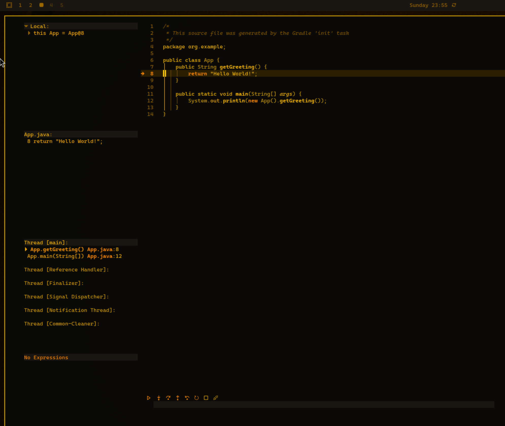

# Omarchy post install config


## Table of Contents
- [Run in one command (also installs wget)](#run-in-one-command-also-installs-wget)
- [Links](#links)
- [Check package name](#check-package-name)
  - [Run just the remapper](#run-just-the-remapper)
  - [Run master script](#run-master-script)
- [Installs](#installs)
- [Uninstalls](#uninstalls)
- [Debugger](#debugger)
- [Mount NTFS drive](#mount-ntfs-drive)
- [Themes](#themes)
- [Change live wallpaper](#change-live-wallpaper)
- [Use VMWare Workstation (Win/Linux) or Fusion (Mac) to test the script on an Omarchy VM](#use-vmware-workstation-winlinux-or-fusion-mac-to-test-the-script-on-an-omarchy-vm)
- [Making an Omarchy Bootable USB on Mac](#making-an-omarchy-bootable-usb-on-mac)

## Run in one command (also installs wget)
```
sudo pacman -Syu --noconfirm git wget && \
cd /tmp && \
git clone https://github.com/mihaialexandruteodor/Omarchy-Post-Install-Config.git && \
cd Omarchy-Post-Install-Config && \
chmod +x master_script.sh && \
bash master_script.sh && \
cd /tmp && rm -rf Omarchy-Post-Install-Config
```

## Links

[typecraft video](https://www.youtube.com/watch?v=d23jFJmcaMI)

[Omarchy wiki - remove packages](https://learn.omacom.io/2/the-omarchy-manual/66/other-packages?search=remove)

[Also check: Omarchy Cleaner](https://github.com/maxart/omarchy-cleaner)

## Check package name
``` 
pacman -Qo [program-name]
```

### Run just the remapper
```
chmod +x ./scripts/remapper.sh && ./scripts/remapper.sh
```

## Run master script
``` 
chmod +x ./master_script.sh && ./master_script.sh
```

## Installs
- [x] Brave Browser
- [x] neofetch
- [x] ntfs-3g
- [x] eslint
- [x] gradle
- [x] mpvpaper (live wallpapers)
- [x] Steam

## Uninstalls
- [x] Chromium

## Debugger

Debugging works out of the box in Omarchy LazyVim, luckily. Yes, even Java!

Open LazyVim with `Leader+Shift+n` or `nvim` in terminal
Press `x` to go to LazyExtra
Press `x` on lines ***Plugins/dap.core*** and ***Languages/lang.java***

You need a pom.xml, gradle.build or .git to debug
Open debug menu with `Leader+d`, b is to toggle breakpoint, c to launch/continue, but you also have a debug CLI!

## Mount NTFS drive
1. **Identify the drive**
   ```bash
   lsblk
   ```
   Find your media SSD (for example, `/dev/sdb1`).

2. **Create a mount point**
   ```bash
   sudo mkdir /mnt/media
   ```

3. **Mount the drive**
   ```bash
   sudo mount -t ntfs-3g /dev/sdb1 /mnt/media
   ```
   (This uses the FUSE-based NTFS driver.)

4. **Optional: Make it permanent**
   Add a line to `/etc/fstab`:
   ```
   /dev/sdb1   /mnt/media   ntfs-3g   defaults,uid=1000,gid=1000   0   0
   ```
   (Adjust `uid` and `gid` to match your user if needed.)

5. **Unmount when done**
   ```bash
   sudo umount /mnt/media
   ```

## Themes
- [x] [Omarchy RetroPC Theme](https://github.com/rondilley/omarchy-retropc-theme)

## Change live wallpaper
```
mpvpaper -o "no-audio loop" "$(hyprctl monitors -j | jq -r '.[0].name')" /path/to/video.mp4
```

to make it work in vmware, run with no software decoding
```
mpvpaper -o "no-hwdec gpu-context=wayland loop" "$(hyprctl monitors -j | jq -r '.[0].name')" /path/to/video.mp4
```
------

# --- Use VMWare Workstation (Win/Linux) or Fusion (Mac) to test the script on an Omarchy VM ---
 Specify ``` Other Linux 6.x kernel 64-bit ``` during install, give the vm plenty of memory.

 Resolution might not be proper out of the box, this will prevent apps or the terminal to show.

 Use `Ctrl+Alt+F3` to open new TTY terminal
 Do the steps from [this guide](https://tillnet.se/index.php/2025/10/17/omarchy-on-vmware/):

 ```
sudo pacman -Sy nano

Start by installing vm-tools:
sudo pacman -S open-vm-tools
sudo systemctl enable vmtoolsd

Two config files need to be edited.

envs.conf
nano ~/.config/hypr/envs.conf

Add this line to the config and save:
env = LIBGL_ALWAYS_SOFTWARE, 1

monitors.conf
nano ~/.config/hypr/monitors.conf

Add(replace) these line to the config and save:
env = GDK_SCALE,1
and this line for a set resolution of 1920×1080:
monitor=,1920x1080@60,auto,1
or this line if you run in maximized window:
monitor=,preferred,auto,1

Reboot system

Done! Know it should work.
```
## Making an Omarchy Bootable USB on Mac

### Use UNetbootin to flash the USB
[UNetbootin](https://unetbootin.github.io/)

